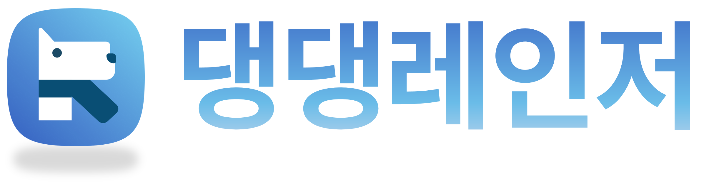
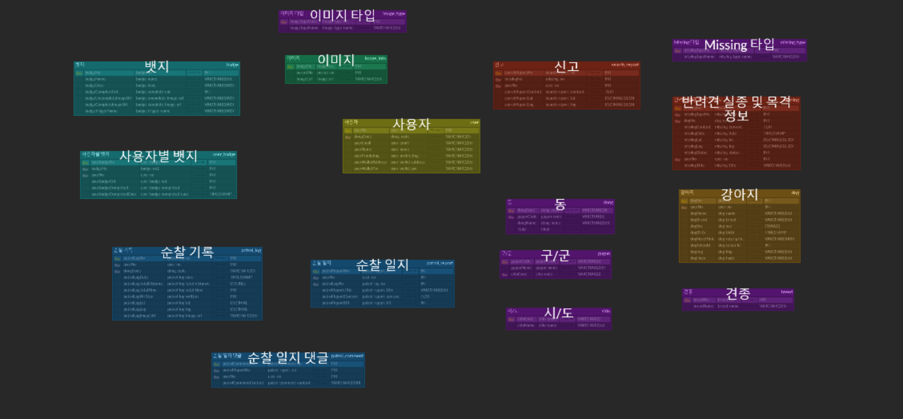
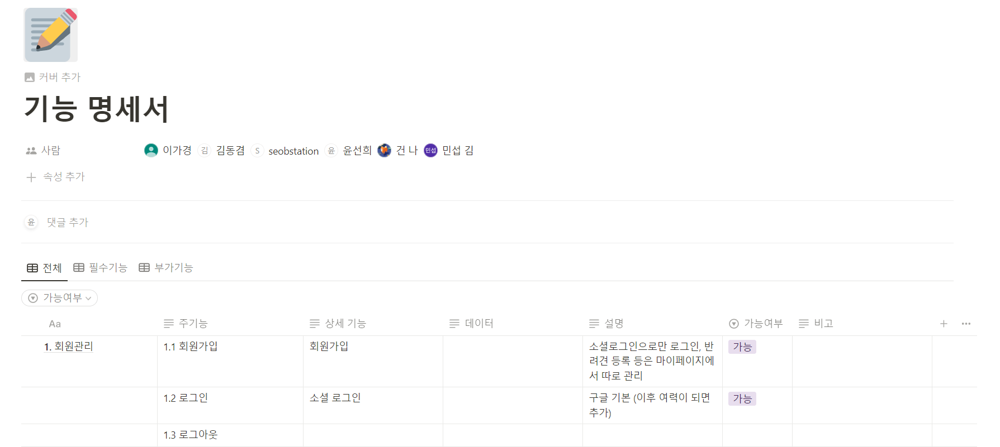
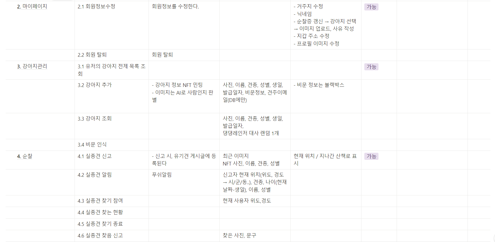
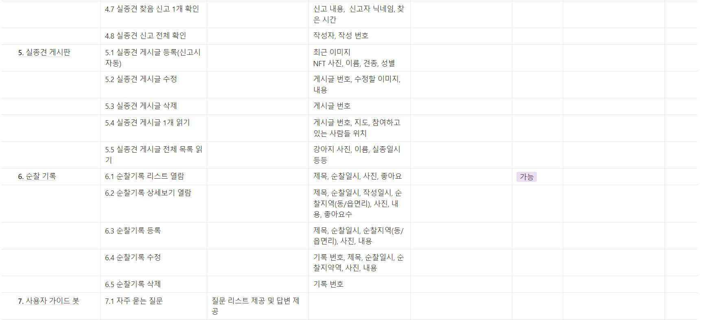

# 댕댕레인저
  
  

## 💌 프로젝트 개요  

2023.10.10 ~ 2023.11.17(6주)

### 기획 배경
  

  

## :heart: 역할

|  |  Part | Detail |
| --- | --- | --- |
| 김동겸 | Back-End | 인프라 / 실종견, 함께 찾기 API |
| 김민섭 | Front-End | - |
| 나건 | Back-End | - |
| 윤선희 | Back-End | - |
| 이가경 | Back-End | - |
| 이성섭 | Front-End | 컴포넌트 flow, UI |
 

## 🕹️ 기술 스택

### Front

### Back

### Infra
- Nginx
- Docker
- Gitlab
- Jenkins
  

## 🧵 환경 설정  

- [바로가기](./exec/portingManual.pdf)

## 🔎 서비스 소개  

### 회원 관리 

### 강아지 관리  

### 순찰 

### 실종견 신고

### 함께 찾기

### 사용자 가이드  
  
  

## 📋 프로젝트 산출물
### DB ERD
  

### 요구사항 명세서
  
  
  

### API명세서
  

### 아키텍쳐 다이어그램

## 📽️ UCC
  

## 💎 느낀 점(소감)
### 🐶김동겸🐶  
> 이번에 처음으로 인프라를 담당하며 배포와 CI/CD를 진행해 보았는데,
> 알아야 될 내용도 많고 여러 오류도 많이 접하면서 성장할 수 있는 좋은 경험이 된 것 같습니다.
> 거기에 앞선 프로젝트에서 백엔드 역할에 많이 참여하지 못해서 아쉬웠었는데, 이번에 API 개발에
> 많이 참여하고, 좀 더 성장한 것 같아 만족스러운 프로젝트였습니다.
### 🐶김민섭🐶  
### 🐶나건🐶  
### 🐶윤선희🐶  
### 🐶이가경🐶  
### 🐶이성섭🐶  
> react-native를 활용해 실시간 위치 공유를 활용할 수 있어서 좋았습니다.
> 또한, 기존의 2가지 프로젝트를 통해 배운 프론트 역량을 활용할 수 있어서 좋았습니다.
